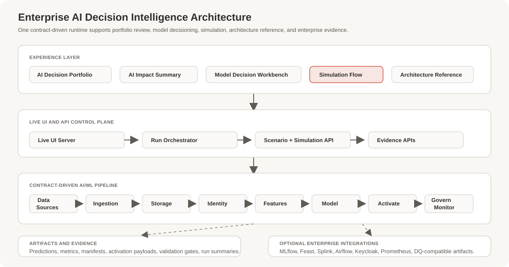

# Enterprise AI Decision Intelligence Platform

An enterprise-grade AI/ML application for turning governed customer, marketing, and experiment data into explainable model recommendations, impact forecasts, activation outputs, and operational evidence.

The application is built around four decision models:

1. TensorFlow Next Best Action Model
2. TensorFlow Churn Propensity Model
3. Bayesian Media Mix Optimization
4. Causal Incrementality Model

It can run as a standalone local app without external deployment dependencies, while also exposing optional enterprise integration paths for lineage, feature store, identity resolution, orchestration, access control, monitoring, and metrics.

## Business Problem

Many organizations have customer data, campaign data, and model experiments spread across disconnected tools. Business teams often see model outputs without enough evidence to trust them, while technical teams must explain lineage, data quality, model health, and deployment readiness across separate systems.

This creates four common problems:

1. Decisions are delayed because business stakeholders cannot see why a model recommendation is trustworthy.
2. AI/ML teams struggle to connect model outputs to activation-ready business actions.
3. Governance, data-quality, and model-readiness evidence is hard to inspect in one place.
4. Enterprise architecture conversations become abstract because the pipeline, artifacts, and controls are not visible end to end.

## How This App Solves It

The app presents a full AI/ML decision workflow from model input to business action.



It uses one contract-driven backend pipeline for all use cases:

```text
Data Sources
-> Ingestion + Event Bus
-> Raw Storage + Curated Warehouse
-> Identity Resolution + Customer 360
-> Feature Layer
-> Model Layer
-> Serving + Activation
-> Monitoring + Governance
```

Each run produces inspectable artifacts under `artifacts/`, including model predictions, metrics, manifests, activation payloads, validation gates, lineage-compatible outputs, and run summaries.

The UI turns those artifacts into a guided presentation:

1. **AI Decision Portfolio** shows the model portfolio and recommended storytelling sequence.
2. **AI Impact Summary** shows portfolio-level business impact, model health, and latest run status.
3. **Model Decision Workbench** walks through model inputs, recommendations, forecasts, and decision evidence.
4. **Simulation Flow** lets users change use case, runtime, scenario, and failure injection, then run the pipeline stage by stage.
5. **Architecture Reference** explains the technical architecture, eight ML stages, runtime profiles, and enterprise integration path.

## User Benefits

Business users get:

1. A clear view of what each AI/ML model recommends.
2. Business-friendly impact metrics such as expected uplift, churn risk, forecast error, and true lift.
3. A structured way to present AI decisions to stakeholders.
4. Confidence that model outputs are backed by evidence, not static mockups.

Technical users get:

1. A contract-driven architecture that is easy to inspect and extend.
2. Stage-by-stage evidence for data, features, models, activation, and governance.
3. Runtime controls for standalone execution, integrated runtime mode, scenario presets, and failure simulation.
4. Optional enterprise integration paths for MLflow, Feast, Splink, Airflow, Keycloak, Prometheus, and data-quality artifacts.

Executives and platform leaders get:

1. A single presentation surface for AI/ML business value and architecture readiness.
2. A standalone app that can be shared without requiring cloud deployment.
3. A credible path from local proof to enterprise MLOps architecture.

## Documentation

| Document | Purpose |
| --- | --- |
| [User Guide PDF](docs/USER_GUIDE.pdf) | Business and technical user walkthrough. |
| [User Guide Source](docs/USER_GUIDE.md) | Markdown source for the PDF. |
| [Technical README](docs/TECHNICAL_README.md) | AI/ML architecture, runtime, data flow, and integration details. |
| [GitHub Check-In Checklist](docs/GITHUB_CHECKIN_CHECKLIST.md) | First-push checklist, ignored files, and validation commands. |
| [API Reference](docs/API_REFERENCE.md) | Live API endpoints, contracts, and error payloads. |
| [Generated Technical Architecture](docs/TECHNICAL_ARCHITECTURE.md) | Auto-generated code architecture reference. |
| [Enterprise Integration Plan](docs/ENTERPRISE_HARDENING_PRODUCT_MODE_PLAN.md) | Optional product-hardening and enterprise integration roadmap. |
| [Scope Lock](docs/SCOPE_LOCK.md) | Canonical scope and status reference. |

## Quick Start

Prerequisites:

1. Python 3.11+
2. `pip`

Create and activate a virtual environment:

```bash
python3 -m venv .venv
source .venv/bin/activate
python3 -m pip install -r requirements.txt
```

Optional ML dependencies:

```bash
python3 -m pip install -r requirements-ml.txt
```

Start the standalone app:

```bash
make standalone
```

Open:

```text
http://127.0.0.1:8080/ui/experience/index.html
```

For a faster launch when the environment is already prepared:

```bash
make standalone-fast
```

## Running The UI

Serve the live UI and API:

```bash
make ui-live
```

Open the main pages:

```text
AI Decision Portfolio:      http://127.0.0.1:8080/ui/experience/business-home.html
AI Impact Summary:         http://127.0.0.1:8080/ui/experience/business-exec-summary.html
Model Decision Workbench:  http://127.0.0.1:8080/ui/experience/workbench.html
Simulation Flow:           http://127.0.0.1:8080/ui/experience/index.html#simulate
Architecture Reference:    http://127.0.0.1:8080/ui/experience/index.html#overview
```

Build static UI data from latest artifacts:

```bash
make ui-build-data
```

Serve the static UI:

```bash
make ui-serve
```

## Running AI/ML Workflows

List configured use cases:

```bash
python3 -m pipelines.cli list-configs
```

Run all full-stack model workflows:

```bash
python3 -m pipelines.cli run-stack-all
```

Run one model workflow:

```bash
python3 -m pipelines.cli run-stack --use-case UC-NBA-RET-001
```

Run in synthetic-only standalone mode:

```bash
python3 -m pipelines.cli run-stack --use-case UC-NBA-RET-001 --runtime-mode synthetic_only
```

Run with a deterministic scenario preset:

```bash
python3 -m pipelines.cli run-stack --use-case UC-NBA-RET-001 --runtime-mode synthetic_only --scenario-id nba_high_risk_save
```

Run with real datasets:

```bash
python3 -m pipelines.cli run-stack-all --source-data-root data/production --require-real-data
```

Run with integrated infrastructure profile:

```bash
python3 -m pipelines.cli run-stack-all --infra-profile oss
```

## Runtime Profiles

| Profile | Purpose |
| --- | --- |
| Standalone AI Runtime | Dependency-light local execution using file-backed artifacts. |
| Integrated AI Runtime | Optional Kafka/Postgres/MinIO mirroring through the OSS profile. |
| Enterprise Integration Profile | Optional readiness paths for MLflow, Feast, Splink, Airflow, Keycloak, monitoring, and metrics. |

The standalone app remains dependency-free from external deployment services. Optional integrations are profile-driven and only connect to external tools when enabled.

## Useful Commands

```bash
make install
make install-ml
make standalone
make standalone-fast
make smoke-standalone
make ui-live
make ui-build-data
make run-stack-all
make run-stack-all-oss
make model-registry-list
make portfolio-summary
make baseline-report
make docs-gen
make docs-check
make test
```

## Run History And Governance

Inspect recent runs:

```bash
python3 -m pipelines.cli list-runs
python3 -m pipelines.cli show-run --use-case UC-NBA-RET-001 --run-id <run_id>
python3 -m pipelines.cli show-stages --use-case UC-NBA-RET-001 --run-id <run_id>
python3 -m pipelines.cli show-data-quality --use-case UC-NBA-RET-001 --run-id <run_id>
```

Inspect model lifecycle:

```bash
python3 -m pipelines.cli model-registry-list
python3 -m pipelines.cli model-readiness --use-case UC-NBA-RET-001 --run-id <run_id>
python3 -m pipelines.cli model-promote --use-case UC-NBA-RET-001 --run-id <run_id> --to approved
```

Approve governance warnings:

```bash
python3 -m pipelines.cli governance-approve --use-case UC-NBA-RET-001 --run-id <run_id> --accept-all-warnings
```

## Testing

Run the test suite:

```bash
pytest -q
```

Run the standalone smoke test:

```bash
make smoke-standalone
```

Run OSS integration tests:

```bash
make test-oss
```

## Repository Map

```text
use_cases/configs/        AI/ML use-case contracts
stack/layers/             Eight-stage runtime implementation
models/                   Model implementations and registry
pipelines/                CLI and contract helpers
scripts/ui_live_server.py Live UI/API server
ui/experience/            Enterprise AI/ML presentation UI
ui/adapter/               View-model generation
artifacts/                Run outputs, metrics, manifests, evidence
docs/                     User, technical, API, and generated documentation
tests/                    Unit and integration tests
```

## Portability Notes

1. The standalone path uses local Python execution and repo-relative artifacts.
2. UI-facing artifact paths are normalized to `artifacts/...` so machine-specific absolute paths do not appear in the app.
3. The application does not require cloud-managed services to run locally.
4. Optional integrated runtime and enterprise profile features can be enabled when the target environment supports them.
