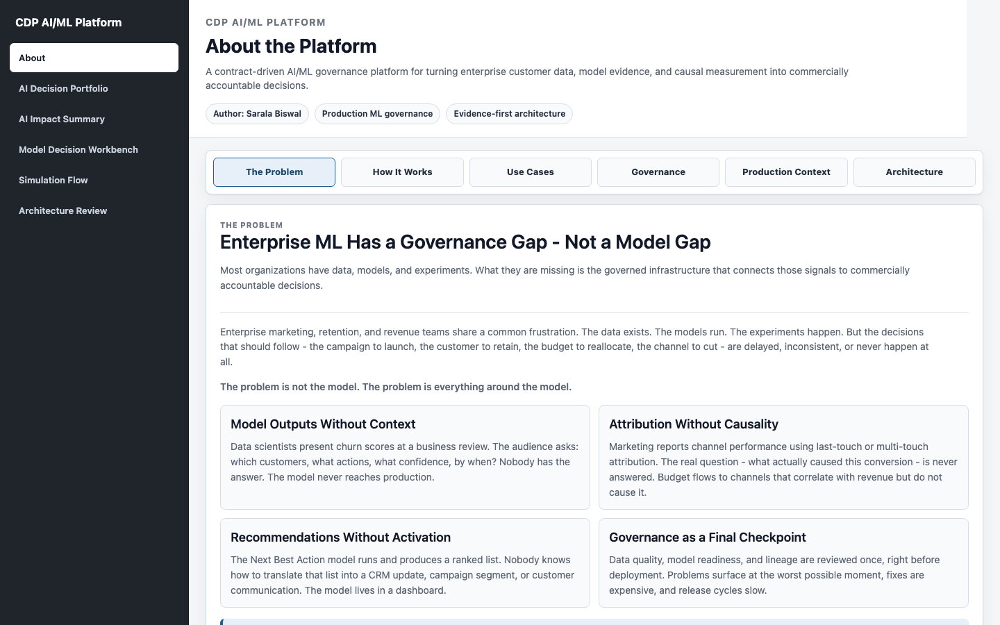
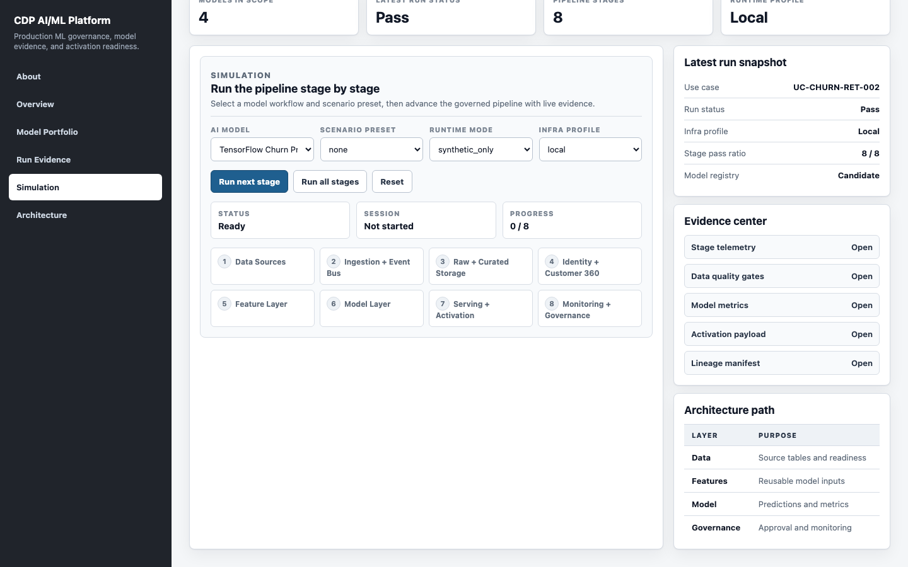
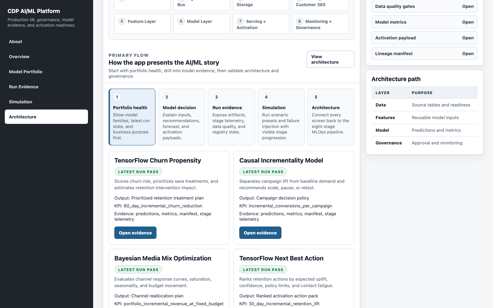
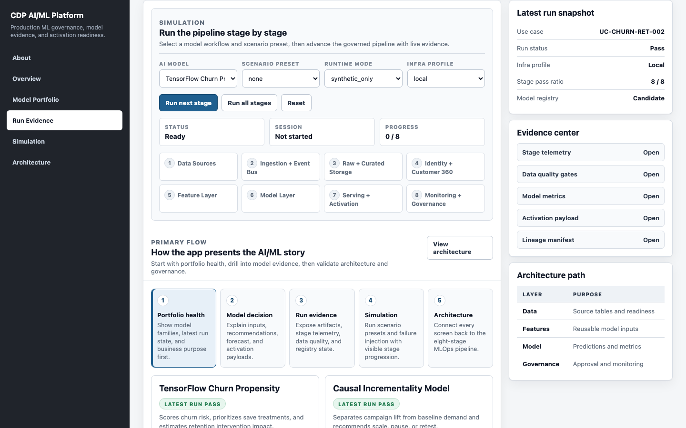

# User Guide: CDP AI/ML Platform - Production ML Governance

This guide explains how to use the current CDP AI/ML Platform application for business review, model decisioning, live simulation, evidence inspection, and architecture review.

## 1. What The App Does

The application helps teams move from governed customer data to accountable AI/ML decisions. It is organized around four model workflows:

1. TensorFlow Next Best Action Model
2. TensorFlow Churn Propensity Model
3. Bayesian Media Mix Optimization
4. Causal Incrementality Model

Each workflow connects model inputs, recommendations, impact forecasts, decision evidence, activation outputs, and governance evidence.

## 2. Current App Navigation

The left navigation starts with the context page, then moves into the working pages:

| Order | Page | URL | Purpose |
| --- | --- | --- | --- |
| 1 | About | `/ui/experience/about.html` | Platform context, problem statement, use cases, governance model, production context, and architecture tabs |
| 2 | AI Decision Portfolio | `/ui/experience/business-home.html` | Business-facing model portfolio and recommended story flow |
| 3 | AI Impact Summary | `/ui/experience/business-exec-summary.html` | Executive portfolio health and model impact summary |
| 4 | Model Decision Workbench | `/ui/experience/workbench.html` | Model-level decision walkthrough and evidence review |
| 5 | Simulation Flow | `/ui/experience/index.html#simulation` | Main action page for scenario selection and stage-by-stage execution |
| 6 | Architecture Review | `/ui/experience/index.html#architecture` | Architecture path and governance traceability |

## 3. Recommended Walkthrough

Use this sequence for a complete demo:

1. Start with **About** to explain the governance gap and the platform thesis.
2. Open **AI Decision Portfolio** to introduce the four model workflows.
3. Open **Model Decision Workbench** for one model and walk from Model Inputs to Decision Evidence.
4. Open **AI Impact Summary** for portfolio-level health and executive reporting.
5. Open **Simulation Flow** to run the platform stage by stage.
6. Use **Run Evidence** and **Architecture Review** to explain artifacts, lineage, and governance.

## 4. Visual Walkthrough

### Step 1: Start With About

Use About to explain why the platform exists before showing the operational screens. The page has six tabs: The Problem, How It Works, Use Cases, Governance, Production Context, and Architecture.



What to point out:

1. The platform is focused on the governance gap around enterprise ML, not only model training.
2. The six tabs separate business context, implementation model, use cases, governance, production history, and architecture.
3. About is the first navigation item across the app.

### Step 2: Open AI Decision Portfolio

Use AI Decision Portfolio to introduce the model portfolio and the recommended presentation sequence.


What to point out:

1. Four governed AI/ML decision workflows.
2. Each model has a decision output and primary business metric.
3. Each card opens the Model Decision Workbench for that scenario.

### Step 3: Review Model Inputs

Open a model workflow and start with Model Inputs. This step shows whether governed source volume, features, and scorable rows are ready before recommendations are reviewed.


What to point out:

1. The left rail keeps model selection, evidence view, and step navigation visible.
2. The center panel explains one decision step at a time.
3. The right panel confirms run ID, status, stage pass rate, and runtime.

### Step 4: Review Decision Evidence

Move to Decision Evidence to close the business workflow with uplift, confidence, activation records, and run status.


What to point out:

1. Expected uplift summarizes predicted business value.
2. Decision confidence gives the average model confidence signal.
3. Activation records show that outputs are ready for downstream decisioning.

### Step 5: Review AI Impact Summary

Open AI Impact Summary for an executive view across the model portfolio.


What to point out:

1. Portfolio-level model health and latest run status.
2. Model-level decisions, KPIs, and readiness.
3. The page can be printed or saved as a PDF for executive review.

### Step 6: Run Simulation Flow

Simulation Flow is the main action page. It is intentionally focused on the controls used to run or explain the pipeline.



What to point out:

1. Select an AI model, scenario preset, runtime mode, and infra profile.
2. Use **Run next stage** to advance the pipeline gradually.
3. Use **Run all stages** for a full scenario execution.
4. The stage tiles show progress across the eight-stage governed pipeline.

### Step 7: Review Architecture

Use Architecture Review to connect the user experience back to the platform layers and governance path.



What to point out:

1. Data, feature, model, and governance layers are shown as the operating path.
2. Architecture is secondary to the action workflow, but useful for technical review.
3. The same pipeline stages support all four model workflows.

### Step 8: Inspect Run Evidence

Use Run Evidence and the Evidence Center to open stage telemetry, data quality gates, model metrics, activation payloads, and lineage manifests.



What to point out:

1. Evidence links are generated from the latest run artifacts.
2. Stage telemetry and data quality are directly inspectable.
3. Activation payload and lineage links close the audit trail.

### Step 9: Switch To Technical Model Evidence

In the Model Decision Workbench, switch from Model Decision to Model Evidence for a deeper technical review.


What to point out:

1. Technical evidence connects components, APIs, stage outputs, and artifacts.
2. The same workflow can be explained to business or technical audiences without changing apps.
3. Model evidence supports readiness and governance conversations.

## 5. Starting The App

From the repository root:

```bash
make standalone
```

Open:

```text
http://127.0.0.1:8080/ui/experience/about.html
```

If dependencies and artifacts already exist:

```bash
make standalone-fast
```

For live UI/API mode:

```bash
make ui-live
```

## 6. Business User Guide

Business users should focus on the decision story and model impact.

### Step 1: Open About

Start with the platform thesis:

1. Enterprise ML has a governance gap, not a model gap.
2. The platform connects data, models, evidence, and activation.
3. The four use cases cover retention, churn, media mix, and incrementality.

### Step 2: Open AI Decision Portfolio

Use the portfolio page to understand which models are available and what each model is designed to decide.

Look for:

1. Model name
2. Decision output
3. Primary business metric
4. Recommended presentation sequence

### Step 3: Open A Model Workflow

Click `Open Model Workflow` for one of the models.

Recommended first workflow:

```text
TensorFlow Next Best Action Model
```

### Step 4: Walk The Business Steps

In the Model Decision Workbench, use the left-side step navigation:

1. Model Inputs
2. Model Recommendation
3. Impact Forecast
4. Decision Evidence

Use these questions while presenting:

1. What customer, campaign, or spend signals entered the model?
2. What does the model recommend?
3. What impact does the model forecast?
4. What evidence supports the decision?

### Step 5: Review AI Impact Summary

Open AI Impact Summary to see portfolio-level model health.

Look for:

1. Models reviewed
2. Models healthy
3. Average pipeline pass rate
4. Latest run status
5. Model-specific business KPIs

## 7. Technical User Guide

Technical users should focus on simulation, stage evidence, artifacts, and governance.

### Step 1: Open Simulation Flow

Use Simulation Flow as the operational surface.

Controls:

1. **AI model** - selects the use case.
2. **Scenario preset** - selects deterministic scenario behavior.
3. **Runtime mode** - choose `synthetic_only` or `default`.
4. **Infra profile** - choose `local` or `oss`.
5. **Run next stage** - advances one stage.
6. **Run all stages** - executes the full eight-stage flow.
7. **Reset** - resets the simulation session.

The pipeline stages are:

```text
Data Sources
-> Ingestion + Event Bus
-> Raw Storage + Curated Warehouse
-> Identity Resolution + Customer 360
-> Feature Layer
-> Model Layer
-> Serving + Activation
-> Monitoring + Governance
```

### Step 2: Use Scenario Presets

Available deterministic presets include:

| Use Case | Scenario Preset |
| --- | --- |
| UC-NBA-RET-001 | `nba_high_risk_save` |
| UC-NBA-RET-001 | `nba_dq_failure_demo` |
| UC-CHURN-RET-002 | `churn_support_surge` |
| UC-MMM-PLN-003 | `mmm_budget_rebalance` |
| UC-INCR-MKT-004 | `incrementality_negative_lift` |

### Step 3: Inspect Run Evidence

Use Run Evidence or the right-side Evidence Center to inspect:

1. Stage telemetry
2. Data quality gates
3. Model metrics
4. Activation payload
5. Lineage manifest

### Step 4: Use Model Evidence View

Open Model Decision Workbench and select `Model Evidence`.

Use this view to inspect:

1. Contract controls
2. Stage inputs and outputs
3. Model backend
4. Model metrics
5. Activation payloads
6. Validation gates
7. Artifact paths

## 8. Runtime Profiles

| Profile | Use When |
| --- | --- |
| Local / Standalone | You want the app to run locally without external services. |
| OSS Integrated | You want to show Kafka, Postgres, and MinIO-style infrastructure mirroring. |
| Enterprise Integration | You want to show readiness for MLflow, Feast, Splink, Airflow, Keycloak, monitoring, and metrics. |

The app can run standalone without deployment dependencies. Enterprise integrations are optional.

## 9. Common Commands

### Run all model workflows

```bash
python3 -m pipelines.cli run-stack-all
```

### Run one workflow

```bash
python3 -m pipelines.cli run-stack --use-case UC-NBA-RET-001
```

### Run a deterministic scenario

```bash
python3 -m pipelines.cli run-stack --use-case UC-NBA-RET-001 \
  --runtime-mode synthetic_only \
  --scenario-id nba_high_risk_save
```

### Run a governance failure demo

```bash
python3 -m pipelines.cli run-stack --use-case UC-NBA-RET-001 \
  --runtime-mode synthetic_only \
  --scenario-id nba_dq_failure_demo
```

### View recent runs

```bash
python3 -m pipelines.cli list-runs
```

### Inspect run stages

```bash
python3 -m pipelines.cli show-stages --use-case UC-NBA-RET-001 --run-id <run_id>
```

### Inspect model readiness

```bash
python3 -m pipelines.cli model-readiness --use-case UC-NBA-RET-001 --run-id <run_id>
```

## 10. Troubleshooting

If the app is not loading:

1. Confirm the server is running.
2. Confirm the URL uses the right port.
3. Run `make standalone-fast` if dependencies and artifacts already exist.
4. Run `make smoke-standalone` to validate the app.

If model evidence is missing:

1. Run at least one workflow.
2. Refresh the page.
3. Check `artifacts/<use_case_id>/<run_id>/summary.json`.

If Simulation controls do not respond:

1. Confirm the live server is running with `make ui-live` or `make standalone`.
2. Confirm `/api/health` returns `ok`.
3. Use the `local` infra profile first, then switch to `oss` when optional services are available.

## 11. What To Show In A Meeting

For business stakeholders:

1. About
2. AI Decision Portfolio
3. One Model Decision Workbench workflow
4. AI Impact Summary

For technical stakeholders:

1. About - Architecture tab
2. Simulation Flow
3. Run Evidence
4. Model Evidence View
5. Architecture Review

For platform leaders:

1. Business value from model workflows
2. Evidence-backed governance
3. Simulation-driven execution
4. Runtime profiles and enterprise integration path
