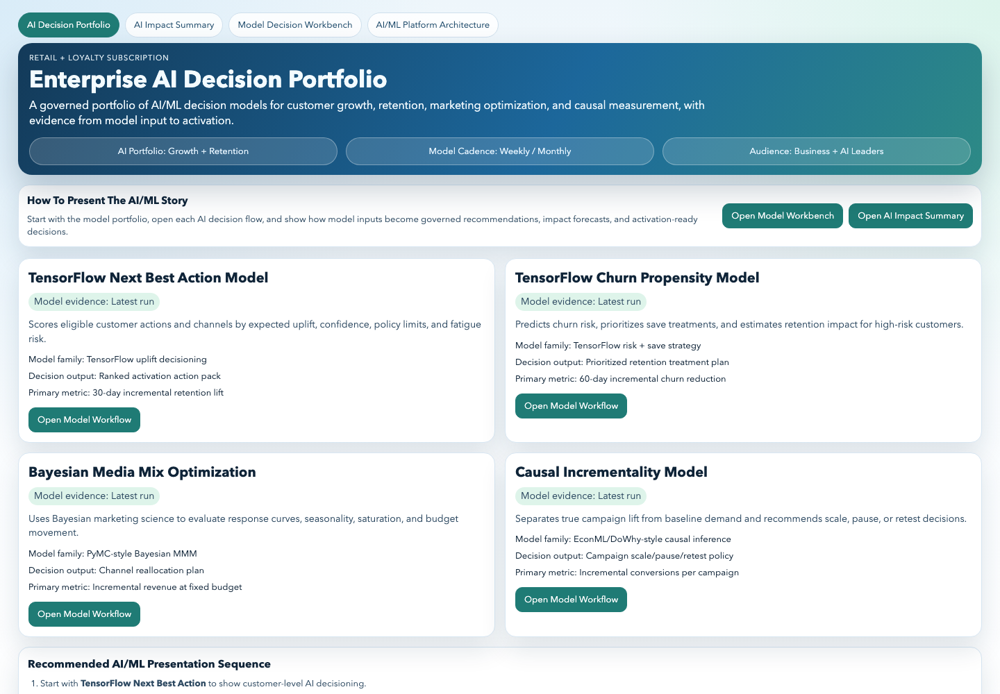
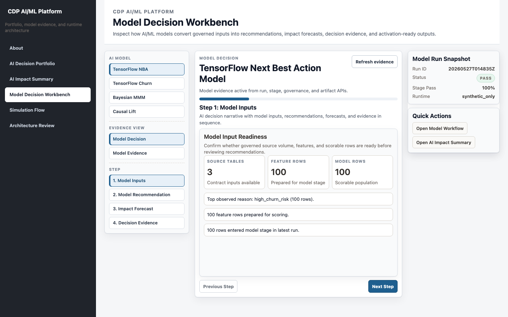
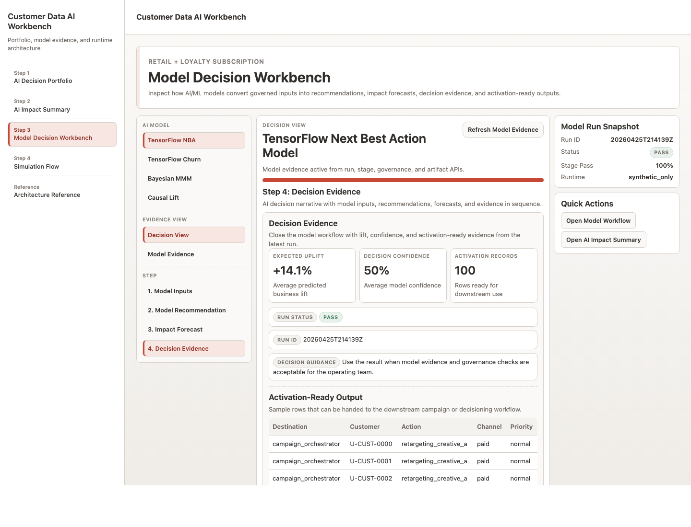
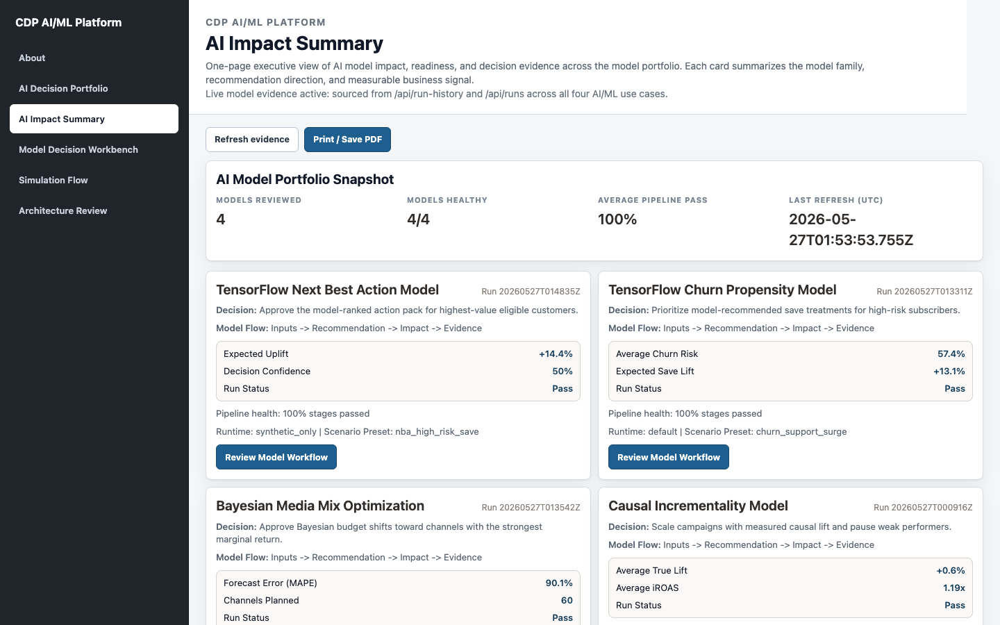
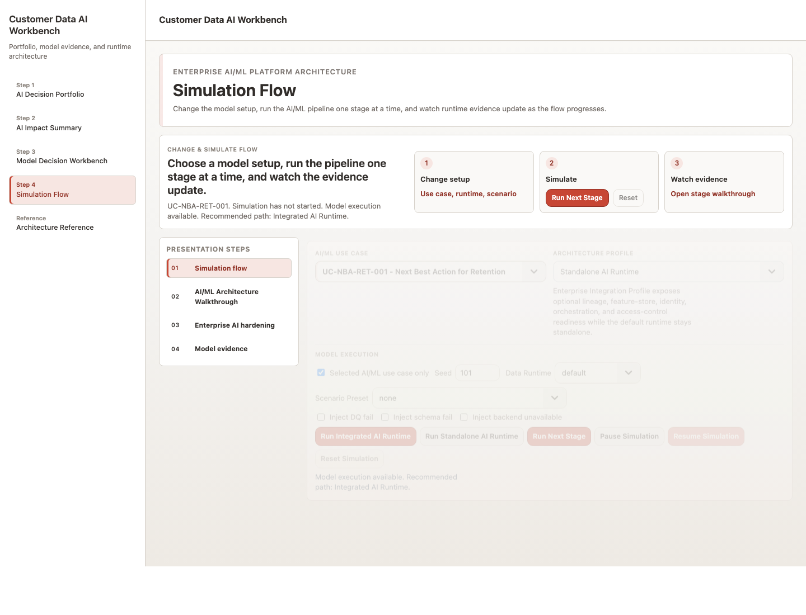
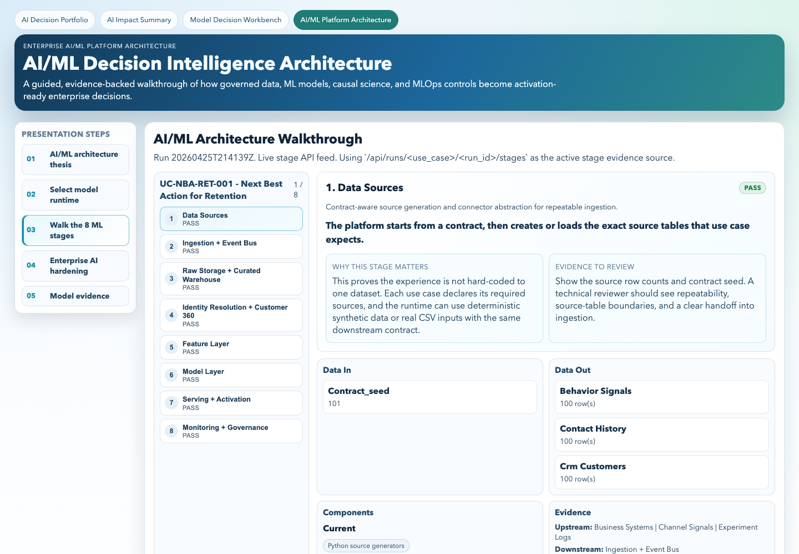
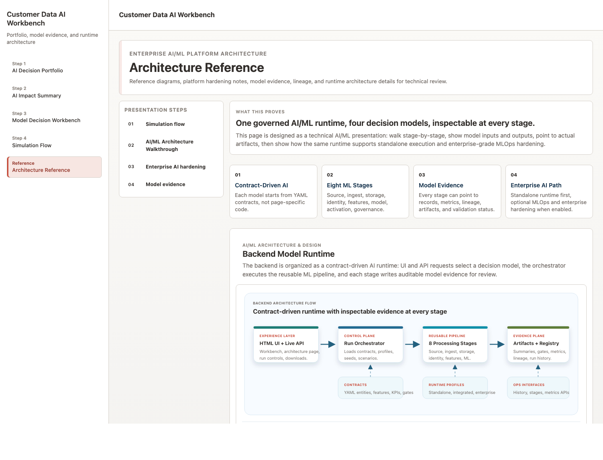
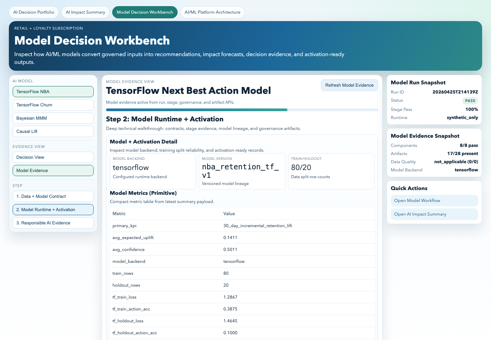

# User Guide: CDP AI/ML Platform — Production ML Governance

This guide explains how business users and technical users should use the application.

## 1. What The App Does

The application helps teams review AI/ML decision models, understand their business impact, and inspect the technical evidence behind each run.

It is organized around four model workflows:

1. TensorFlow Next Best Action Model
2. TensorFlow Churn Propensity Model
3. Bayesian Media Mix Optimization
4. Causal Incrementality Model

Each workflow moves from model inputs to recommendation, impact forecast, decision evidence, activation output, and governance evidence.

## 2. Recommended Presentation Flow

Use this sequence for an end-to-end walkthrough:

1. Start at AI Decision Portfolio.
2. Open AI Impact Summary to show portfolio-level health.
3. Open the Model Decision Workbench.
4. Walk through model inputs, recommendation, impact forecast, and decision evidence.
5. Open Simulation Flow to change setup and run the AI/ML pipeline one stage at a time.
6. Open Architecture Review to explain the technical runtime and evidence path.

## 3. Visual Walkthrough

The screenshots below show the recommended flow a user should follow during a business or technical walkthrough.

### Flow Step 1: Start With The AI Decision Portfolio

Use this page to introduce the model portfolio and explain the four AI/ML decision workflows.



What to point out:

1. Four governed AI/ML decision models.
2. Each model has a clear business purpose and primary metric.
3. The recommended presentation sequence starts with customer-level AI decisioning.

### Flow Step 2: Open The Model Decision Workbench

Open a model workflow and start with Model Inputs. This is where users see the data readiness and scorable population before looking at recommendations.



What to point out:

1. The left navigation keeps model, evidence view, and step selection visible.
2. The center panel explains one decision step at a time.
3. The right-side snapshot confirms run ID, status, stage pass rate, and runtime.

### Flow Step 3: Review Decision Evidence

Move to Decision Evidence to close the business workflow with uplift, confidence, activation records, and run status.



What to point out:

1. Expected uplift summarizes predicted business value.
2. Decision confidence shows the average model confidence signal.
3. Activation records show that outputs are ready for downstream decisioning.

### Flow Step 4: Review AI Impact Summary

Open AI Impact Summary when you need a portfolio-level executive view.



What to point out:

1. Models reviewed and models healthy.
2. Average pipeline pass rate.
3. Model-level decisions, KPIs, and latest run status.

### Flow Step 5: Run The Simulation Flow

Open Simulation Flow to change the AI/ML use case, runtime profile, scenario preset, seed, or failure injection, then run the pipeline stage by stage.



What to point out:

1. AI/ML Use Case is a dropdown so users can switch models.
2. Model Execution controls expose runtime, scenario, seed, and failure simulation.
3. Run Next Stage advances the walkthrough and updates runtime evidence.

### Flow Step 6: Walk The AI/ML Architecture

Use AI/ML Architecture Walkthrough to explain the pipeline from Data Sources to Monitoring + Governance.



What to point out:

1. Each stage has a runtime responsibility.
2. Each stage produces artifacts or metrics.
3. Technical users can inspect inputs, outputs, components, and evidence.

### Flow Step 7: Review Architecture And Evidence

Use Architecture Review and Model Evidence to review platform diagrams, architecture flow, run history, and portfolio health.



What to point out:

1. Architecture Review separates platform diagrams from action-oriented simulation.
2. Model Evidence shows run artifacts and execution evidence.
3. Model Run History compares recent runs.
4. AI Portfolio Health summarizes latest run status across use cases.

### Flow Step 8: Switch To Technical Model Evidence

In the Model Decision Workbench, switch from Model Decision to Model Evidence for a deeper technical review.



What to point out:

1. Contract controls show use case, runtime, scenario, and model constraints.
2. Technical evidence connects components, APIs, stage outputs, and artifacts.
3. The same workflow can be explained to business users or technical users without changing apps.

## 4. Starting The App

From the repository root:

```bash
make standalone
```

Open:

```text
http://127.0.0.1:8080/ui/experience/index.html
```

If the environment is already prepared:

```bash
make standalone-fast
```

For live UI/API mode:

```bash
make ui-live
```

## 5. Main Pages

| Page | URL | Primary Audience |
| --- | --- | --- |
| AI Decision Portfolio | `/ui/experience/business-home.html` | Business and executive users |
| AI Impact Summary | `/ui/experience/business-exec-summary.html` | Executives and business owners |
| Model Decision Workbench | `/ui/experience/workbench.html` | Business users and technical reviewers |
| Simulation Flow | `/ui/experience/index.html#simulate` | Architects, ML engineers, and platform teams |
| Architecture Review | `/ui/experience/index.html#overview` | Architects, ML engineers, and platform teams |

## 6. Business User Guide

Business users should focus on the decision story and model impact.

### Step 1: Open AI Decision Portfolio

Use the portfolio page to understand which models are available and what each model is designed to decide.

Look for:

1. Model name
2. Decision output
3. Primary business metric
4. Recommended presentation sequence

### Step 2: Open A Model Workflow

Click `Open Model Workflow` for one of the models.

Recommended first workflow:

```text
TensorFlow Next Best Action Model
```

### Step 3: Walk The Business Steps

In the Model Decision Workbench, use the left-side step navigation:

1. Model Inputs
2. Model Recommendation
3. Impact Forecast
4. Decision Evidence

Use these questions while presenting:

1. What customer, campaign, or spend signals entered the model?
2. What does the model recommend?
3. What impact does the model forecast?
4. What evidence supports the decision?

### Step 4: Review The AI Impact Summary

Open AI Impact Summary to see portfolio-level model health.

Look for:

1. Models reviewed
2. Models healthy
3. Average pipeline pass rate
4. Latest run status
5. Model-specific business KPIs

### Step 5: Share Or Print

Use `Print / Save PDF` on the AI Impact Summary page when you need an executive-ready output.

## 7. Technical User Guide

Technical users should focus on architecture, run evidence, artifacts, and governance.

### Step 1: Open Simulation Flow

Use Simulation Flow to change the model setup and run the end-to-end platform one stage at a time.

The core architecture is:

```text
Data Sources
-> Ingestion + Event Bus
-> Raw Storage + Curated Warehouse
-> Identity Resolution + Customer 360
-> Feature Layer
-> Model Layer
-> Serving + Activation
-> Monitoring + Governance
```

### Step 2: Walk The AI/ML Architecture

Use AI/ML Architecture Walkthrough to walk stage by stage.

For each stage, review:

1. What the stage does
2. Data in
3. Data out
4. Components
5. Evidence artifacts

### Step 3: Use Model Evidence View

Open Model Decision Workbench and select `Model Evidence`.

Use this view to inspect:

1. Contract controls
2. Stage inputs and outputs
3. Model backend
4. Model metrics
5. Activation payloads
6. Validation gates
7. Artifact paths

### Step 4: Inspect Architecture Review And Model Evidence

Open Architecture Review for platform diagrams, then open Model Evidence for run artifacts and history.

Review:

1. Architecture Review
2. Model Evidence
3. Model Run History
4. AI Portfolio Health

### Step 5: Run A New Model Workflow

Use Model Execution controls on Simulation Flow.

Common options:

1. Select an AI/ML use case.
2. Choose Standalone AI Runtime or Integrated AI Runtime.
3. Choose runtime mode.
4. Select a scenario preset if needed.
5. Click Run Standalone AI Runtime or Run Integrated AI Runtime.

### Step 6: Simulate Stage Execution

Use the simulation controls to explain the pipeline gradually:

1. Run Next Stage
2. Pause Simulation
3. Resume Simulation
4. Reset Simulation

This is useful when presenting the architecture to technical audiences.

## 8. Runtime Profiles

| Profile | Use When |
| --- | --- |
| Standalone AI Runtime | You want the app to run locally without external services. |
| Integrated AI Runtime | You want to show optional Kafka, Postgres, or MinIO-style infrastructure mirroring. |
| Enterprise Integration Profile | You want to show readiness for MLflow, Feast, Splink, Airflow, Keycloak, monitoring, and metrics. |

The app can run standalone without deployment dependencies. Enterprise integrations are optional.

## 9. Common Tasks

### Run all model workflows

```bash
python3 -m pipelines.cli run-stack-all
```

### Run one workflow

```bash
python3 -m pipelines.cli run-stack --use-case UC-NBA-RET-001
```

### Run synthetic-only mode

```bash
python3 -m pipelines.cli run-stack --use-case UC-NBA-RET-001 --runtime-mode synthetic_only
```

### View recent runs

```bash
python3 -m pipelines.cli list-runs
```

### Inspect run stages

```bash
python3 -m pipelines.cli show-stages --use-case UC-NBA-RET-001 --run-id <run_id>
```

### Inspect model readiness

```bash
python3 -m pipelines.cli model-readiness --use-case UC-NBA-RET-001 --run-id <run_id>
```

## 10. Troubleshooting

If the app is not loading:

1. Confirm the server is running.
2. Confirm the URL uses the right port.
3. Run `make standalone-fast` if dependencies and artifacts already exist.
4. Run `make smoke-standalone` to validate the app.

If model evidence is missing:

1. Run at least one workflow.
2. Refresh the page.
3. Check `artifacts/<use_case_id>/<run_id>/summary.json`.

If integrated runtime is unavailable:

1. Use Standalone AI Runtime.
2. Confirm optional infrastructure is running before using Integrated AI Runtime.

## 11. What To Show In A Meeting

For business stakeholders:

1. AI Decision Portfolio
2. One Model Workflow
3. AI Impact Summary

For technical stakeholders:

1. AI/ML Platform Architecture
2. Eight ML stages
3. Model Evidence View
4. Model Run History
5. Runtime Evidence

For platform leaders:

1. Business value from model workflows
2. Evidence-backed architecture
3. Standalone runtime
4. Enterprise integration path
